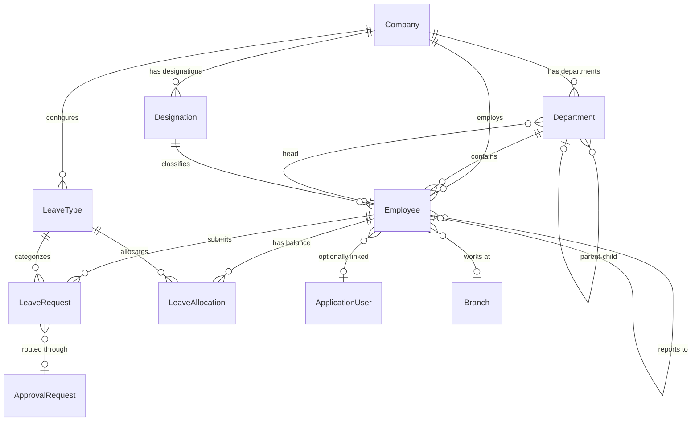

# Xorva ERP — HR Module: Complete Specification

**Module:** `Xorva.Modules.HR`  
**Author:** System Architect  
**Date:** July 16, 2026  
**For:** Day 4 Implementation (Friday, July 17)  
**Architecture:** Modular Monolith — Module-owned entities in `Modules/Xorva.Modules.HR/Entities/`

---

## 1. How HR Works in Real ERP Systems

### 1.1 What Is HR in an ERP?

HR (Human Resource Management) in an ERP is NOT just a list of employees. In production ERP systems used by companies worldwide, the HR module is the **central person registry** that feeds data into:

- **Payroll** → needs salary, bank details, allowances, deductions
- **Accounting** → needs salary journal entries, cost center allocation
- **Approval Engine** → needs org hierarchy (who reports to whom)
- **Leave Management** → needs employee status, join date, leave balance
- **Attendance** → needs shift schedules, working hours
- **Dashboard & Reports** → needs headcount, turnover rate, leave analytics

Without a proper HR module, NONE of the above modules can function. HR is the **backbone** of a business ERP.

### 1.2 The HR Data Flow in a Real Company

```
CEO (Tenant SuperAdmin) creates → Company
    ↓
GM (CompanyAdmin) creates → Departments + Designations
    ↓
HR Manager creates → Employee Records (linked to Department + Designation)
    ↓
Employee logs in → Views own profile, applies for leave
    ↓
Manager → Sees team, approves/rejects leave
    ↓
Payroll (Phase 2) → Reads employee salary + attendance → generates payslips
```

### 1.3 The 5 Core HR Sub-Modules (Industry Standard)

Every production ERP (SAP, Oracle HCM, Odoo, ERPNext) has these:

| # | Sub-Module | What It Does | Priority for Xorva |
|---|-----------|-------------|:------------------:|
| 1 | **Departments** | Organizational structure — where people sit | ✅ Phase 1 |
| 2 | **Designations** | Job titles + hierarchy levels — what people ARE | ✅ Phase 1 |
| 3 | **Employees** | The people — personal info, employment, bank, etc. | ✅ Phase 1 |
| 4 | **Leave Management** | Apply, approve, track leave + balances | ✅ Phase 1 |
| 5 | **Attendance** | Clock in/out, shift schedules, overtime | ❌ Phase 2 |

**Why Attendance is Phase 2:** Attendance requires biometric/geo integration, shift scheduling engine, overtime calculation rules — this is 3-5 days of work alone. For MVP, companies can track attendance externally and enter it manually later.

**Why Leave Management is Phase 1:** Leave is the **#1 most-used HR feature** by every employee, every day. It's also the PERFECT showcase for the Approval Engine — "Employee submits leave → Manager approves in inbox → Leave recorded." Without it, the HR module has zero employee-facing functionality.

---

## 2. HR in the Xorva Context

### 2.1 Multi-Tenancy Rules

Every HR entity is **company-scoped** (extends `CompanyEntity`):

```
Tenant: RightSource Group
├── Company: RightSource Trading
│   ├── Department: Sales (this belongs to Trading ONLY)
│   ├── Department: Finance
│   ├── Employee: Ahmed (in Trading → Sales)
│   └── Employee: Sara (in Trading → Finance)
│
└── Company: RightSource IT
    ├── Department: Engineering (this belongs to IT ONLY)
    ├── Employee: Ali (in IT → Engineering)
    └── Employee: Fatima (in IT → Engineering)
```

**Key rule:** Ahmed (Trading) can NEVER see Ali (IT). The global query filter (`CompanyEntity` filter) enforces this automatically — zero code needed in the HR module.

### 2.2 The Employee ≠ User Distinction

> **Critical design decision for enterprise ERP:**

| Concept | What It Is | Example |
|---------|-----------|---------|
| **ApplicationUser** | Someone who can LOGIN to the ERP | HR Manager Sara, CEO |
| **Employee** | Someone who WORKS at the company | Driver Hassan, Factory Worker Khalid |

**Not every employee logs in.** A delivery driver doesn't need ERP access. A factory worker doesn't have a company email. But they ARE employees — they have salaries, leave balances, and appear in headcount reports.

**Not every user is an employee.** An external auditor might have login access but isn't on the payroll.

**Relationship:** `Employee.UserId? → ApplicationUser.Id` — **Optional 1:1**. When an employee IS also a user, they're linked. When not, `UserId` is null.

### 2.3 Role Access Matrix for HR

| Endpoint | SystemAdmin | SuperAdmin | CompanyAdmin | Manager | Employee |
|----------|:-----------:|:----------:|:------------:|:-------:|:--------:|
| **Departments** |
| Create/Update/Delete Department | ❌ | ✅ all companies | ✅ own company | ❌ | ❌ |
| List Departments | ❌ | ✅ all companies | ✅ own company | ✅ own company | ✅ own company |
| **Designations** |
| Create/Update/Delete Designation | ❌ | ✅ | ✅ own company | ❌ | ❌ |
| List Designations | ❌ | ✅ | ✅ | ✅ | ✅ |
| **Employees** |
| Create Employee | ❌ | ✅ | ✅ own company | ❌ | ❌ |
| Update Employee | ❌ | ✅ | ✅ own company | ✅ own dept only | ❌ |
| List Employees | ❌ | ✅ all companies | ✅ own company | ✅ own dept | ❌ |
| Get My Profile | ❌ | ✅ | ✅ | ✅ | ✅ |
| **Leave** |
| Configure Leave Types | ❌ | ✅ | ✅ own company | ❌ | ❌ |
| Apply for Leave | ❌ | ❌ | ❌ | ✅ | ✅ |
| View My Leave Balance | ❌ | ❌ | ❌ | ✅ | ✅ |
| View Team Leaves | ❌ | ✅ all | ✅ all depts | ✅ own dept | ❌ |

---

## 3. Entities — Complete Field-Level Design

### 3.1 Department

**Location:** `Modules/Xorva.Modules.HR/Entities/Department.cs`  
**Base class:** `CompanyEntity` (inherits TenantId, CompanyId, Id, CreatedAt, UpdatedAt)

| Field | Type | Constraints | Description |
|-------|------|-------------|-------------|
| `Name` | `string` | Required, max 100, unique per company | e.g., "Sales", "Engineering", "Finance" |
| `Code` | `string` | Required, max 20, unique per company | Short code: "SALES", "ENG", "FIN" |
| `Description` | `string?` | Max 500 | Optional description of department function |
| `HeadEmployeeId` | `Guid?` | FK → Employee | Department head (typically a Manager) |
| `ParentDepartmentId` | `Guid?` | FK → Department (self-ref) | For sub-departments: Engineering → Backend Team |
| `IsActive` | `bool` | Default true | Soft-delete flag |
| `SortOrder` | `int` | Default 0 | Display ordering |

**Navigation properties:**
- `HeadEmployee` → `Employee?`
- `ParentDepartment` → `Department?`
- `SubDepartments` → `ICollection<Department>`
- `Employees` → `ICollection<Employee>`

**Business rules:**
- Name must be unique within the same company
- Code must be unique within the same company
- Cannot delete a department that has active employees (return error)
- ParentDepartmentId must be a department in the SAME company
- HeadEmployeeId must be an employee in the SAME company

---

### 3.2 Designation

**Location:** `Modules/Xorva.Modules.HR/Entities/Designation.cs`  
**Base class:** `CompanyEntity`

| Field | Type | Constraints | Description |
|-------|------|-------------|-------------|
| `Title` | `string` | Required, max 100, unique per company | e.g., "Software Engineer", "Sales Manager", "CEO" |
| `Code` | `string?` | Max 20 | Short code: "SE", "SM" |
| `Level` | `int` | Required, 1-10 | Hierarchy: 1=C-Level, 2=VP, 3=Director, 4=Manager, 5=Senior, 6=Mid, 7=Junior, 8=Intern |
| `Description` | `string?` | Max 500 | Job description summary |
| `IsActive` | `bool` | Default true | Soft-delete flag |
| `SortOrder` | `int` | Default 0 | Display ordering |

**Why Designations exist separately from Departments:**

A "Senior Engineer" designation can exist across multiple departments (IT, Consulting, Product). The designation defines the **role tier** (for pay grades and hierarchy), while the department defines **where they work**. Separating them is how every production ERP works — it allows:
- Pay grade rules based on designation level
- Org chart generation
- Career path tracking (Junior → Mid → Senior → Lead → Manager)

---

### 3.3 Employee

**Location:** `Modules/Xorva.Modules.HR/Entities/Employee.cs`  
**Base class:** `CompanyEntity`

#### Personal Information

| Field | Type | Constraints | Description |
|-------|------|-------------|-------------|
| `EmployeeCode` | `string` | Required, max 20, unique per company | Auto-generated: "EMP-0001", "EMP-0002" |
| `FirstName` | `string` | Required, max 100 | |
| `LastName` | `string` | Required, max 100 | |
| `FullName` | computed | | `$"{FirstName} {LastName}"` |
| `Email` | `string?` | Max 256 | Work email (optional — not all employees have one) |
| `Phone` | `string?` | Max 20 | |
| `DateOfBirth` | `DateTime?` | | Used for age calculations in reports |
| `Gender` | `Gender` enum | Required | Male, Female, Other |
| `Nationality` | `string?` | Max 100 | |
| `NationalId` | `string?` | Max 50 | National ID / Iqama / Visa number |
| `MaritalStatus` | `MaritalStatus` enum | | Single, Married, Divorced, Widowed |

#### Employment Information

| Field | Type | Constraints | Description |
|-------|------|-------------|-------------|
| `DepartmentId` | `Guid` | FK → Department, Required | Which department |
| `DesignationId` | `Guid` | FK → Designation, Required | Job title |
| `ReportingToId` | `Guid?` | FK → Employee (self-ref) | Direct manager for approval chain |
| `BranchId` | `Guid?` | FK → Branch | Work location |
| `JoinDate` | `DateTime` | Required | Employment start date |
| `ProbationEndDate` | `DateTime?` | | Auto-calculated: JoinDate + 3/6 months |
| `ConfirmationDate` | `DateTime?` | | Date when probation ended |
| `EmploymentType` | `EmploymentType` enum | Required | FullTime, PartTime, Contract, Intern |
| `EmploymentStatus` | `EmploymentStatus` enum | Required | Active, OnProbation, OnLeave, Resigned, Terminated |
| `BasicSalary` | `decimal` | Required, >= 0 | Monthly base salary |
| `Currency` | `string` | Default from company settings | Salary currency |

#### Bank Details

| Field | Type | Constraints | Description |
|-------|------|-------------|-------------|
| `BankName` | `string?` | Max 100 | |
| `AccountNumber` | `string?` | Max 50 | |
| `IBAN` | `string?` | Max 34 | International Bank Account Number |

#### System Fields

| Field | Type | Constraints | Description |
|-------|------|-------------|-------------|
| `UserId` | `Guid?` | FK → ApplicationUser | Optional — link to login account |
| `IsActive` | `bool` | Default true | |
| `Notes` | `string?` | Max 2000 | Internal HR notes |
| `ProfilePhotoUrl` | `string?` | Max 500 | URL to uploaded photo |

**Enums needed:**
```
Gender: Male = 0, Female = 1, Other = 2

MaritalStatus: Single = 0, Married = 1, Divorced = 2, Widowed = 3

EmploymentType: FullTime = 0, PartTime = 1, Contract = 2, Intern = 3

EmploymentStatus: Active = 0, OnProbation = 1, OnLeave = 2, Resigned = 3, Terminated = 4
```

**Business rules:**
- EmployeeCode auto-generated per company (not globally): "EMP-0001" is unique within Trading, but IT can also have "EMP-0001"
- Email can be null (not all employees have company email)
- If `UserId` is set, the user must belong to the SAME company
- DepartmentId and DesignationId must belong to the SAME company
- Cannot create employee with salary < 0
- ReportingToId cannot be self (employee cannot report to themselves)
- When status changes to Resigned/Terminated → set `IsActive = false`

---

### 3.4 LeaveType

**Location:** `Modules/Xorva.Modules.HR/Entities/LeaveType.cs`  
**Base class:** `CompanyEntity`

| Field | Type | Constraints | Description |
|-------|------|-------------|-------------|
| `Name` | `string` | Required, max 100, unique per company | "Annual Leave", "Sick Leave", "Unpaid Leave" |
| `Code` | `string` | Required, max 20, unique per company | "AL", "SL", "UL", "ML" |
| `DefaultDays` | `decimal` | Required, >= 0 | Default allocation per year (e.g., 30 for annual) |
| `IsPaid` | `bool` | Default true | Is this a paid leave type? |
| `IsCarryForward` | `bool` | Default false | Can unused days carry to next year? |
| `MaxCarryForward` | `decimal` | Default 0 | Max days that can carry forward |
| `RequiresAttachment` | `bool` | Default false | E.g., sick leave needs medical certificate |
| `IsActive` | `bool` | Default true | |
| `SortOrder` | `int` | Default 0 | |
| `Description` | `string?` | Max 500 | Policy description |

**Default Leave Types (seeded per company on creation):**

| Name | Code | Default Days | Paid? | Carry Forward? |
|------|------|:------------:|:-----:|:--------------:|
| Annual Leave | AL | 30 | Yes | Yes (max 10) |
| Sick Leave | SL | 15 | Yes | No |
| Unpaid Leave | UL | 0 (unlimited) | No | No |
| Maternity Leave | ML | 90 | Yes | No |
| Emergency Leave | EL | 5 | Yes | No |

---

### 3.5 LeaveAllocation

**Location:** `Modules/Xorva.Modules.HR/Entities/LeaveAllocation.cs`  
**Base class:** `CompanyEntity`

| Field | Type | Constraints | Description |
|-------|------|-------------|-------------|
| `EmployeeId` | `Guid` | FK → Employee, Required | |
| `LeaveTypeId` | `Guid` | FK → LeaveType, Required | |
| `Year` | `int` | Required | Calendar year (2026, 2027...) |
| `TotalDays` | `decimal` | >= 0 | Total allocated (may differ from default per employee) |
| `UsedDays` | `decimal` | >= 0 | Days consumed by approved leaves |
| `RemainingDays` | computed | | `TotalDays - UsedDays` |

**Business rules:**
- Unique per (EmployeeId + LeaveTypeId + Year) — one allocation per type per year
- When a leave is approved → `UsedDays` increments
- When a leave is cancelled → `UsedDays` decrements
- When employee joins mid-year → prorate `TotalDays` based on join date
- If `IsCarryForward` on leave type → add carried days to next year's allocation (up to MaxCarryForward)

---

### 3.6 LeaveRequest

**Location:** `Modules/Xorva.Modules.HR/Entities/LeaveRequest.cs`  
**Base class:** `CompanyEntity`

| Field | Type | Constraints | Description |
|-------|------|-------------|-------------|
| `EmployeeId` | `Guid` | FK → Employee, Required | Who is requesting |
| `LeaveTypeId` | `Guid` | FK → LeaveType, Required | Type of leave |
| `FromDate` | `DateTime` | Required | Start date |
| `ToDate` | `DateTime` | Required, >= FromDate | End date |
| `TotalDays` | `decimal` | Computed or input | Number of leave days |
| `Reason` | `string` | Required, max 1000 | Why they need leave |
| `Status` | `LeaveStatus` enum | Required | Draft, Pending, Approved, Rejected, Cancelled |
| `ApprovalRequestId` | `Guid?` | FK → ApprovalRequest | Links to approval engine (null if no rule) |
| `RejectionReason` | `string?` | Max 500 | Why it was rejected |
| `AttachmentUrl` | `string?` | Max 500 | Medical certificate, etc. |

**Enum:**
```
LeaveStatus: Draft = 0, Pending = 1, Approved = 2, Rejected = 3, Cancelled = 4
```

**Business rules:**
- Cannot apply for leave on past dates
- Cannot apply if remaining balance < requested days (except Unpaid Leave)
- Cannot apply for overlapping dates with existing approved/pending leave
- Only the employee themselves OR their manager/admin can create a leave request
- Only Pending leaves can be cancelled
- If leave type `RequiresAttachment = true` → attachment is required for > 2 days
- When approved → update LeaveAllocation.UsedDays
- When cancelled (after approval) → decrement LeaveAllocation.UsedDays

---

## 4. API Endpoints — Complete

### 4.1 Departments

| Method | Endpoint | Auth | Description |
|--------|----------|------|-------------|
| `POST` | `/api/departments` | CompanyAdmin+ | Create department |
| `GET` | `/api/departments` | All (company-filtered) | List departments |
| `GET` | `/api/departments/{id}` | All | Get department + employee count |
| `PUT` | `/api/departments/{id}` | CompanyAdmin+ | Update department |
| `DELETE` | `/api/departments/{id}` | CompanyAdmin+ | Soft-delete (fails if active employees) |

**POST /api/departments — Request:**
```json
{
  "name": "Engineering",
  "code": "ENG",
  "description": "Software development team",
  "parentDepartmentId": null,
  "headEmployeeId": null
}
```

**Response (201):**
```json
{
  "success": true,
  "data": {
    "id": "...",
    "name": "Engineering",
    "code": "ENG",
    "description": "Software development team",
    "parentDepartmentId": null,
    "headEmployeeId": null,
    "headEmployeeName": null,
    "employeeCount": 0,
    "isActive": true,
    "createdAt": "..."
  }
}
```

### 4.2 Designations

| Method | Endpoint | Auth | Description |
|--------|----------|------|-------------|
| `POST` | `/api/designations` | CompanyAdmin+ | Create designation |
| `GET` | `/api/designations` | All | List designations (sorted by level) |
| `PUT` | `/api/designations/{id}` | CompanyAdmin+ | Update designation |
| `DELETE` | `/api/designations/{id}` | CompanyAdmin+ | Soft-delete |

**POST /api/designations — Request:**
```json
{
  "title": "Senior Software Engineer",
  "code": "SSE",
  "level": 5,
  "description": "Senior-level individual contributor"
}
```

### 4.3 Employees

| Method | Endpoint | Auth | Description |
|--------|----------|------|-------------|
| `POST` | `/api/employees` | CompanyAdmin+ | Create employee (approvable) |
| `GET` | `/api/employees` | Role-scoped | List with pagination + filter |
| `GET` | `/api/employees/{id}` | Role-scoped | Get full profile |
| `GET` | `/api/employees/me` | Any authenticated employee | Get own profile |
| `PUT` | `/api/employees/{id}` | CompanyAdmin+ or Manager (own dept) | Update employee |
| `PUT` | `/api/employees/{id}/status` | CompanyAdmin+ | Change status (approvable for termination) |

**GET /api/employees — Query Parameters:**
```
?page=1
&pageSize=20
&search=ahmed          (searches firstName, lastName, email, code)
&departmentId=...      (filter by department)
&designationId=...     (filter by designation)
&status=Active         (filter by employment status)
&employmentType=FullTime
&sortBy=joinDate       (name, joinDate, department)
&sortDir=desc
```

**POST /api/employees — Request:**
```json
{
  "firstName": "Ahmed",
  "lastName": "Al-Mansouri",
  "email": "ahmed@rightsource.ae",
  "phone": "+971501234567",
  "dateOfBirth": "1990-05-15",
  "gender": "Male",
  "nationality": "UAE",
  "nationalId": "784-1990-1234567-1",
  "maritalStatus": "Married",
  "departmentId": "...",
  "designationId": "...",
  "reportingToId": "...",
  "branchId": "...",
  "joinDate": "2026-07-17",
  "employmentType": "FullTime",
  "basicSalary": 15000,
  "bankName": "Emirates NBD",
  "accountNumber": "1234567890",
  "iban": "AE070331234567890123456",
  "createUserAccount": true
}
```

**Employee DTO Response:**
```json
{
  "id": "...",
  "employeeCode": "EMP-0001",
  "firstName": "Ahmed",
  "lastName": "Al-Mansouri",
  "fullName": "Ahmed Al-Mansouri",
  "email": "ahmed@rightsource.ae",
  "phone": "+971501234567",
  "departmentId": "...",
  "departmentName": "Engineering",
  "designationId": "...",
  "designationTitle": "Senior Software Engineer",
  "reportingToId": "...",
  "reportingToName": "Sara Khan",
  "branchId": "...",
  "branchName": "Dubai Office",
  "joinDate": "2026-07-17",
  "employmentType": "FullTime",
  "employmentStatus": "Active",
  "basicSalary": 15000,
  "isActive": true,
  "hasUserAccount": true,
  "createdAt": "..."
}
```

### 4.4 Leave Types

| Method | Endpoint | Auth | Description |
|--------|----------|------|-------------|
| `POST` | `/api/leave-types` | CompanyAdmin+ | Create leave type |
| `GET` | `/api/leave-types` | All | List active leave types |
| `PUT` | `/api/leave-types/{id}` | CompanyAdmin+ | Update leave type |
| `DELETE` | `/api/leave-types/{id}` | CompanyAdmin+ | Soft-delete |

### 4.5 Leave Management

| Method | Endpoint | Auth | Description |
|--------|----------|------|-------------|
| `POST` | `/api/leaves` | Employee+ (for self) | Apply for leave (approvable) |
| `GET` | `/api/leaves/me` | Any employee | My leave requests |
| `GET` | `/api/leaves/balance` | Any employee | My leave balances for current year |
| `GET` | `/api/leaves` | Manager+, CompanyAdmin+ | List team/company leaves |
| `PUT` | `/api/leaves/{id}/cancel` | Employee (own) or CompanyAdmin | Cancel pending/approved leave |

**POST /api/leaves — Request:**
```json
{
  "leaveTypeId": "...",
  "fromDate": "2026-07-20",
  "toDate": "2026-07-24",
  "reason": "Family vacation",
  "attachmentUrl": null
}
```

**Response (202 — when approval rule exists):**
```json
{
  "success": true,
  "data": null,
  "message": "Submitted for approval. It will be processed once approvers complete their review.",
  "approvalRequestId": "..."
}
```

**GET /api/leaves/balance — Response:**
```json
{
  "success": true,
  "data": [
    {
      "leaveTypeId": "...",
      "leaveTypeName": "Annual Leave",
      "leaveTypeCode": "AL",
      "year": 2026,
      "totalDays": 30,
      "usedDays": 5,
      "remainingDays": 25,
      "pendingDays": 3
    }
  ]
}
```

---

## 5. Approval Engine Integration

### 5.1 Approvable Actions (Register at Startup)

The HR module registers these with `IApprovableActionRegistry` in `AddHRModule()`:

| ActionKey | Description | Typical Approval Chain |
|-----------|-------------|----------------------|
| `HR.CreateEmployee` | New hire | Manager → CompanyAdmin |
| `HR.LeaveRequest` | Employee leave | Manager |
| `HR.TerminateEmployee` | Employment termination | Manager → CompanyAdmin → CEO |
| `HR.SalaryChange` | Salary update | CompanyAdmin → CEO |

### 5.2 How Leave + Approval Works End-to-End

```
1. CompanyAdmin creates Approval Rule:
   Name: "Leave Approval" | Module: HR | Action: LeaveRequest | Approvers: [Manager]

2. Employee Ahmed submits POST /api/leaves
   → ApprovalCheckBehavior intercepts
   → Finds matching rule for HR.LeaveRequest in Ahmed's company
   → Serializes command as JSON
   → Creates ApprovalRequest (status = Pending)
   → Returns 202 Accepted

3. Manager Sara sees in GET /api/approvals/pending:
   "Ahmed Al-Mansouri — Annual Leave (Jul 20-24, 2026)"
   → Clicks Approve

4. ApproveRequestCommandHandler:
   → Deserializes original command
   → Replays with _execution.IsReplaying = true
   → ApplyLeaveCommandHandler executes:
     → Creates LeaveRequest (status = Approved)
     → Updates LeaveAllocation.UsedDays += 5
   → Updates ApprovalRequest.Status = Approved

5. Ahmed checks GET /api/leaves/me:
   → "Annual Leave — Jul 20-24 — Approved ✅"
```

---

## 6. Entity Relationship Diagram



---

## 7. Folder Structure

```
Modules/Xorva.Modules.HR/
├── Xorva.Modules.HR.csproj
│
├── Entities/                          ← MODULE-OWNED (not in Core)
│   ├── Department.cs
│   ├── Designation.cs
│   ├── Employee.cs
│   ├── LeaveType.cs
│   ├── LeaveAllocation.cs
│   └── LeaveRequest.cs
│
├── Enums/
│   ├── Gender.cs
│   ├── MaritalStatus.cs
│   ├── EmploymentType.cs
│   ├── EmploymentStatus.cs
│   └── LeaveStatus.cs
│
├── Commands/
│   ├── CreateDepartment/
│   │   ├── CreateDepartmentCommand.cs
│   │   ├── CreateDepartmentCommandHandler.cs
│   │   └── CreateDepartmentValidator.cs
│   ├── UpdateDepartment/
│   ├── DeleteDepartment/
│   ├── CreateDesignation/
│   ├── UpdateDesignation/
│   ├── DeleteDesignation/
│   ├── CreateEmployee/                    ← implements IApprovableAction
│   ├── UpdateEmployee/
│   ├── ChangeEmployeeStatus/
│   ├── CreateLeaveType/
│   ├── UpdateLeaveType/
│   ├── ApplyLeave/                        ← implements IApprovableAction
│   └── CancelLeave/
│
├── Queries/
│   ├── ListDepartments/
│   ├── GetDepartment/
│   ├── ListDesignations/
│   ├── ListEmployees/                     ← with PagedResult + filtering
│   ├── GetEmployee/
│   ├── GetMyProfile/
│   ├── ListLeaveTypes/
│   ├── GetMyLeaves/
│   ├── GetLeaveBalance/
│   └── ListTeamLeaves/
│
├── DTOs/
│   ├── DepartmentDto.cs
│   ├── DesignationDto.cs
│   ├── EmployeeDto.cs
│   ├── EmployeeSummaryDto.cs
│   ├── LeaveTypeDto.cs
│   ├── LeaveRequestDto.cs
│   └── LeaveBalanceDto.cs
│
└── Extensions/
    └── HRModuleExtensions.cs              ← DI + action registration
```

---

## 8. Database — Indexes and Configurations

### Indexes

| Table | Index | Type |
|-------|-------|------|
| `Departments` | `(CompanyId, Name)` | Unique |
| `Departments` | `(CompanyId, Code)` | Unique |
| `Designations` | `(CompanyId, Title)` | Unique |
| `Employees` | `(CompanyId, EmployeeCode)` | Unique |
| `Employees` | `(CompanyId, DepartmentId)` | Regular |
| `Employees` | `(CompanyId, DesignationId)` | Regular |
| `Employees` | `(CompanyId, EmploymentStatus)` | Regular |
| `LeaveTypes` | `(CompanyId, Code)` | Unique |
| `LeaveAllocations` | `(EmployeeId, LeaveTypeId, Year)` | Unique |
| `LeaveRequests` | `(EmployeeId, Status)` | Regular |
| `LeaveRequests` | `(CompanyId, FromDate, ToDate)` | Regular |

### DbSet Registrations (XorvaDbContext)

```csharp
// HR MODULE
public DbSet<Department> Departments => Set<Department>();
public DbSet<Designation> Designations => Set<Designation>();
public DbSet<Employee> Employees => Set<Employee>();
public DbSet<LeaveType> LeaveTypes => Set<LeaveType>();
public DbSet<LeaveAllocation> LeaveAllocations => Set<LeaveAllocation>();
public DbSet<LeaveRequest> LeaveRequests => Set<LeaveRequest>();
```

---

## 9. Phase 1 vs Phase 2 Scope

### Phase 1 — Build This (Day 4)

| Sub-Module | What to Build |
|------------|---------------|
| Departments | Full CRUD + hierarchy (ParentDepartmentId) |
| Designations | Full CRUD + levels |
| Employees | Full CRUD + rich profile + pagination/filtering + GET /me |
| Leave Types | Full CRUD + default seed |
| Leave Requests | Apply + cancel + balance check + approval integration |
| Leave Allocation | Auto-create on employee creation + balance tracking |

### Phase 2 — NOT Day 4

| Sub-Module | Why Deferred |
|------------|-------------|
| Attendance Tracking | Requires shift schedules, biometric integration, overtime rules |
| Document Management | Requires file upload to Cloudinary, document categories |
| Training and Certifications | Separate sub-domain |
| Loan Management | Linked to Payroll (Phase 2 module) |
| End of Service Gratuity | Complex labor law calculations (country-specific) |
| Probation Auto-Confirmation | Workflow automation — Phase 2 |

---

## 10. Frontend Pages — Day 4

| Page | Route | Priority |
|------|-------|:--------:|
| Departments list + create/edit modal | `/departments` | P1 |
| Designations list + create/edit modal | `/designations` | P1 |
| Employees list (rich table) | `/employees` | P1 |
| Employee create form (multi-section) | `/employees/new` | P1 |
| Employee profile view | `/employees/:id` | P1 |
| Leave types config (admin only) | `/leave-types` | P1 |
| Apply for leave form | `/leaves/apply` | P1 |
| My leaves + balance cards | `/leaves` | P1 |

---

> **This document is the complete blueprint for building the Xorva ERP HR module. Ready for Day 4 implementation.**
