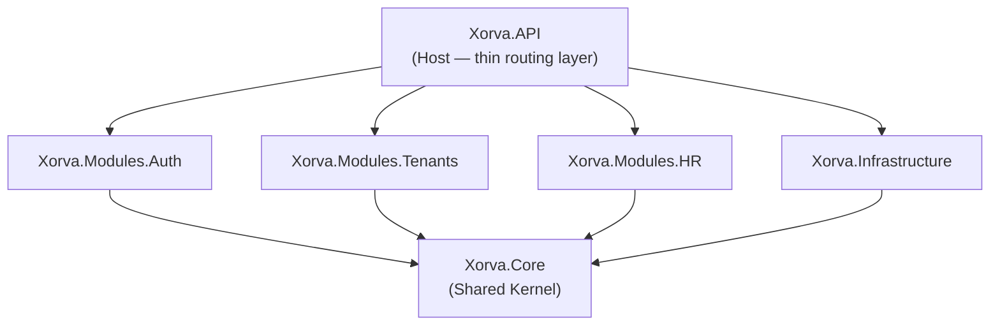
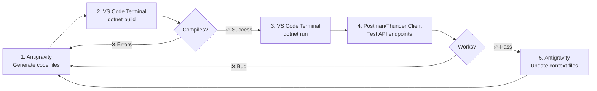
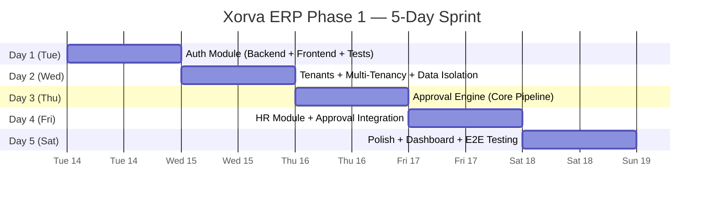

# Xorva ERP — Phase 1: The Complete Execution Plan

**Role:** 20-Year System Architect & Full-Stack Developer  
**Date:** Tuesday, July 14, 2026  
**Deadline:** Saturday, July 19, 2026 (5 working days)  
**Scope:** Auth + Tenant Foundation + Approval Engine + HR Module  
**Stack:** .NET 10 + PostgreSQL 16 (Neon) + React 18 + Vite + TypeScript

---

## 1. Project Summary & Approved Decisions

### What Is Xorva ERP

A cloud-based, multi-tenant ERP platform where a corporation (Tenant) manages multiple Companies, each with their own Branches, Modules, and Users. Built as a Modular Monolith with strict data isolation.

### Tech Stack (All Approved)

| Layer | Technologies |
|-------|-------------|
| **Backend** | .NET 10, C# 14, ASP.NET Core, EF Core, MediatR (CQRS), FluentValidation, JWT |
| **Database** | PostgreSQL 16 on Neon (serverless, auto-scaling) |
| **Frontend** | React 18, Vite, TypeScript, Tailwind CSS, Ant Design 5, TanStack Query, i18next, Recharts |
| **Infrastructure** | Docker, Railway (backend), Vercel (frontend), Cloudinary (files), GitHub |
| **UI Theme** | Dark mode — Void `#0A0A0F`, Abyss `#13131C`, Surface `#1E1E2E`, Purple `#7C6FE0`, Glow `#A78BFA`, Frost `#E2E2F0`, Inter font |

### Prerequisites (Confirmed ✅)

| Requirement | Status |
|------------|--------|
| .NET SDK | ✅ **10.0.301** installed |
| PostgreSQL | ✅ Neon connection string ready |
| Node.js | ✅ Installed |

---

## 2. Phase 1 Scope — The 3 Blocks

| Block | Deliverables | Complexity |
|-------|-------------|------------|
| **Auth & Tenants** | Registration, Login, JWT, Multi-tenancy (EF Core Global Filters + PostgreSQL RLS), RBAC (5 roles), Company Settings | 🔴 High — everything depends on this |
| **Approval Engine** | Rule CRUD, Dynamic Module/Action Registration, Multi-step Sequential Approval, Pending Inbox, History/Audit Trail | 🔴 High — core pipeline feature in Xorva.Core |
| **HR Module** | Departments CRUD, Employees CRUD, Department Assignment, Pagination/Filtering | 🟡 Medium — standard module once foundation exists |

---

## 3. Architecture Decisions

### 3.1 Modular Monolith — The Dependency Graph



> [!IMPORTANT]
> **The Non-Negotiable Rule:** Modules NEVER reference each other. Auth doesn't know HR exists. HR doesn't know Tenants exists. They all reference ONLY `Xorva.Core`. Cross-module communication uses Core abstractions (interfaces, domain events). This is the entire architectural advantage of a Modular Monolith — compile-time isolation between business domains.

### 3.2 Why No `src/` Folder

The `src/` convention comes from Microsoft's open-source repos (ASP.NET Core runtime) that have `eng/`, `tools/`, `build/`, `benchmarks/` at root level. They need `src/` to separate source code from build engineering noise.

**Our project has none of that.** Standard .NET enterprise convention: projects sit directly next to the `.sln` file. No wrapper needed.

```
❌ Over-engineered:  backend/src/Modules/Xorva.Modules.Auth/Commands/LoginUser/LoginUserCommand.cs
✅ Clean:            backend/Modules/Xorva.Modules.Auth/Commands/LoginUser/LoginUserCommand.cs
```

One fewer nesting level on every file path, across thousands of files.

### 3.3 Why `Modules/` Subfolder IS Needed

Without it, you'd have 11+ project folders at the same level when the ERP scales:

```
❌ Flat chaos (by Phase 4):
backend/
├── Xorva.Core/
├── Xorva.Infrastructure/
├── Xorva.API/
├── Xorva.Modules.Auth/
├── Xorva.Modules.Tenants/
├── Xorva.Modules.HR/
├── Xorva.Modules.Accounting/         ← Phase 2
├── Xorva.Modules.Sales/              ← Phase 2
├── Xorva.Modules.Purchasing/         ← Phase 3
├── Xorva.Modules.Inventory/          ← Phase 3
├── Xorva.Modules.Payroll/            ← Phase 3
├── Xorva.Modules.POS/                ← Phase 4
└── 13 folders at one level = unreadable
```

With `Modules/`: 3 core projects at root + 1 `Modules/` folder containing all business modules. Clean, scalable, professional.

### 3.4 Why Controllers Over Minimal APIs

| Approach | When To Use | Our Case |
|----------|------------|----------|
| **Minimal APIs** | Small microservices, 5-10 endpoints | ❌ Not us |
| **Controllers** | Enterprise apps, 50+ endpoints, attribute routing, filters, versioning | ✅ 100+ endpoints at ERP scale |

Controllers are **thin** — they only route HTTP requests to MediatR commands/queries. All business logic lives in the module handlers.

### 3.5 Why `.slnx` Over `.sln`

`.slnx` is the new XML-based solution format in .NET 10. Clean, readable XML instead of the old cryptic `.sln` format with GUIDs. Since we're on .NET 10, we use the modern format.

### 3.6 Where Entities Live

| Entity Type | Location | Reason |
|------------|----------|--------|
| **Base classes** (`BaseEntity`, `AuditableEntity`, `TenantEntity`) | `Xorva.Core/Entities/` | Abstract, no database table. Shared by all modules. |
| **Shared enums** (`SystemRole`, `ApprovalStatus`) | `Xorva.Core/Enums/` | Used across multiple modules. |
| **Interfaces** (`ICurrentTenantService`, `IApprovableAction`) | `Xorva.Core/Interfaces/` | Contracts, not implementations. |
| **Module entities** (`ApplicationUser`, `Department`, `Employee`) | `Xorva.Modules.*/Entities/` | Each module owns its data. Module boundary = data boundary. |
| **Tenant entity** | `Xorva.Core/Entities/` | Exception — every module needs TenantId. Pragmatic for Phase 1. |

### 3.7 CQRS + MediatR — Vertical Slice Per Module

Every module follows this internal structure:

```
Xorva.Modules.Auth/
├── Commands/                              ← Write operations (POST, PUT, DELETE)
│   ├── RegisterUser/
│   │   ├── RegisterUserCommand.cs         ← Request DTO (implements IRequest<T>)
│   │   ├── RegisterUserCommandHandler.cs  ← Business logic (implements IRequestHandler<T>)
│   │   └── RegisterUserValidator.cs       ← FluentValidation rules
│   ├── LoginUser/
│   │   ├── LoginUserCommand.cs
│   │   ├── LoginUserCommandHandler.cs
│   │   └── LoginUserValidator.cs
│   └── RefreshToken/
│       ├── RefreshTokenCommand.cs
│       └── RefreshTokenCommandHandler.cs
├── Queries/                               ← Read operations (GET)
│   ├── GetCurrentUser/
│   │   ├── GetCurrentUserQuery.cs
│   │   └── GetCurrentUserQueryHandler.cs
│   └── GetUsersByRole/
│       ├── GetUsersByRoleQuery.cs
│       └── GetUsersByRoleQueryHandler.cs
├── DTOs/                                  ← Response shapes
│   ├── AuthResponseDto.cs
│   └── UserDto.cs
├── Entities/                              ← Database entities (module-owned)
│   ├── ApplicationUser.cs
│   └── RefreshToken.cs
└── Extensions/
    └── AuthModuleExtensions.cs            ← DI registration for this module
```

> [!TIP]
> **Vertical Slice Architecture** — each feature (Register, Login, etc.) is a self-contained folder with its own Command + Handler + Validator. No "AuthService.cs with 15 methods" anti-pattern. Each handler does ONE thing.

---

## 4. The Complete Folder Structure

```
c:\Users\HP\Desktop\xorvaErp\
│
├── backend/                                    ← .NET Modular Monolith
│   ├── XorvaERP.slnx                          ← Solution file (.NET 10 XML format)
│   │
│   ├── Xorva.Core/                            ← SHARED KERNEL
│   │   ├── Xorva.Core.csproj
│   │   ├── Entities/
│   │   │   ├── BaseEntity.cs                  ← Id (Guid), CreatedAt, UpdatedAt
│   │   │   ├── AuditableEntity.cs             ← CreatedBy, UpdatedBy
│   │   │   └── TenantEntity.cs                ← TenantId, CompanyId (for multi-tenancy)
│   │   ├── Enums/
│   │   │   ├── SystemRole.cs                  ← SystemAdmin, SuperAdmin, CompanyAdmin, Manager, Employee
│   │   │   └── ApprovalStatus.cs              ← Pending, Approved, Rejected
│   │   ├── Interfaces/
│   │   │   ├── ICurrentTenantService.cs       ← Get current TenantId/CompanyId from JWT
│   │   │   ├── IApprovableAction.cs           ← Marker for approval engine
│   │   │   └── IDateTimeProvider.cs           ← Testable time abstraction
│   │   ├── Exceptions/
│   │   │   ├── NotFoundException.cs
│   │   │   ├── ForbiddenException.cs
│   │   │   ├── ConflictException.cs
│   │   │   └── ValidationException.cs
│   │   ├── Common/
│   │   │   ├── ApiResponse.cs                 ← Standard {success, data, message, errors} wrapper
│   │   │   └── PagedResult.cs                 ← Pagination wrapper {items, totalCount, page, pageSize}
│   │   └── Constants/
│   │       └── Permissions.cs
│   │
│   ├── Xorva.Infrastructure/                  ← DATA ACCESS + EXTERNAL SERVICES
│   │   ├── Xorva.Infrastructure.csproj
│   │   ├── Data/
│   │   │   ├── XorvaDbContext.cs              ← EF Core DbContext with global query filters
│   │   │   ├── Configurations/                ← Fluent API entity configurations
│   │   │   │   ├── ApplicationUserConfiguration.cs
│   │   │   │   ├── TenantConfiguration.cs
│   │   │   │   ├── CompanyConfiguration.cs
│   │   │   │   └── ...per entity
│   │   │   └── Migrations/                    ← EF Core auto-generated
│   │   ├── Services/
│   │   │   ├── JwtTokenService.cs             ← Generate + validate JWT tokens
│   │   │   ├── CurrentTenantService.cs        ← Extract TenantId from HttpContext claims
│   │   │   └── PasswordHasher.cs              ← BCrypt password hashing
│   │   └── Extensions/
│   │       └── InfrastructureExtensions.cs     ← DI registration for DbContext, services
│   │
│   ├── Xorva.API/                             ← API HOST (Thin Layer)
│   │   ├── Xorva.API.csproj
│   │   ├── Program.cs                         ← Entry point: DI, middleware pipeline, Swagger
│   │   ├── appsettings.json                   ← Connection string, JWT settings, CORS origins
│   │   ├── appsettings.Development.json
│   │   ├── Controllers/
│   │   │   ├── AuthController.cs              ← Routes → MediatR (Register, Login, Refresh, Me)
│   │   │   ├── TenantsController.cs
│   │   │   ├── CompaniesController.cs
│   │   │   ├── BranchesController.cs
│   │   │   ├── ApprovalRulesController.cs
│   │   │   ├── ApprovalsController.cs
│   │   │   ├── DepartmentsController.cs
│   │   │   └── EmployeesController.cs
│   │   ├── Middleware/
│   │   │   ├── ExceptionMiddleware.cs         ← Global exception → ApiResponse mapping
│   │   │   ├── TenantResolverMiddleware.cs    ← Extract TenantId from JWT, set on scoped service
│   │   │   └── RequestLoggingMiddleware.cs
│   │   └── Filters/
│   │       └── RequireRoleAttribute.cs        ← [RequireRole(SystemRole.CompanyAdmin)] attribute
│   │
│   ├── Modules/                               ← ALL BUSINESS MODULES
│   │   │
│   │   ├── Xorva.Modules.Auth/               ← AUTH MODULE
│   │   │   ├── Xorva.Modules.Auth.csproj
│   │   │   ├── Commands/
│   │   │   │   ├── RegisterUser/
│   │   │   │   ├── LoginUser/
│   │   │   │   └── RefreshToken/
│   │   │   ├── Queries/
│   │   │   │   ├── GetCurrentUser/
│   │   │   │   └── GetUsersByRole/
│   │   │   ├── DTOs/
│   │   │   ├── Entities/
│   │   │   │   ├── ApplicationUser.cs
│   │   │   │   └── RefreshToken.cs
│   │   │   └── Extensions/
│   │   │       └── AuthModuleExtensions.cs
│   │   │
│   │   ├── Xorva.Modules.Tenants/            ← TENANT MODULE
│   │   │   ├── Xorva.Modules.Tenants.csproj
│   │   │   ├── Commands/
│   │   │   │   ├── CreateTenant/
│   │   │   │   ├── CreateCompany/
│   │   │   │   ├── CreateBranch/
│   │   │   │   └── UpdateCompanySettings/
│   │   │   ├── Queries/
│   │   │   │   ├── GetTenantDetails/
│   │   │   │   ├── ListCompanies/
│   │   │   │   └── ListBranches/
│   │   │   ├── DTOs/
│   │   │   ├── Entities/
│   │   │   │   ├── Tenant.cs
│   │   │   │   ├── Company.cs
│   │   │   │   └── Branch.cs
│   │   │   └── Extensions/
│   │   │
│   │   └── Xorva.Modules.HR/                 ← HR MODULE
│   │       ├── Xorva.Modules.HR.csproj
│   │       ├── Commands/
│   │       │   ├── CreateDepartment/
│   │       │   ├── UpdateDepartment/
│   │       │   ├── CreateEmployee/
│   │       │   ├── UpdateEmployee/
│   │       │   └── AssignDepartment/
│   │       ├── Queries/
│   │       │   ├── ListDepartments/
│   │       │   ├── GetDepartment/
│   │       │   ├── ListEmployees/
│   │       │   └── GetEmployee/
│   │       ├── DTOs/
│   │       ├── Entities/
│   │       │   ├── Department.cs
│   │       │   └── Employee.cs
│   │       └── Extensions/
│   │
│   └── Tests/                                 ← ALL TEST PROJECTS
│       ├── Xorva.Tests.Unit/
│       │   ├── Xorva.Tests.Unit.csproj
│       │   ├── Auth/
│       │   │   ├── RegisterUserTests.cs
│       │   │   └── LoginUserTests.cs
│       │   ├── Tenants/
│       │   └── HR/
│       └── Xorva.Tests.Integration/
│           ├── Xorva.Tests.Integration.csproj
│           └── Auth/
│               └── AuthEndpointTests.cs
│
├── frontend/                                   ← React + Vite + TypeScript
│   ├── package.json
│   ├── vite.config.ts
│   ├── tsconfig.json
│   ├── tailwind.config.js
│   ├── index.html
│   └── src/                                   ← src IS standard for React (config files at root need separation)
│       ├── App.tsx
│       ├── main.tsx
│       ├── vite-env.d.ts
│       ├── api/                               ← Axios instance + TanStack Query hooks per module
│       │   ├── client.ts                      ← Axios instance with JWT interceptor
│       │   ├── auth.api.ts
│       │   ├── tenants.api.ts
│       │   └── hr.api.ts
│       ├── components/                        ← Shared, reusable UI components
│       │   ├── AppLayout/
│       │   │   ├── Sidebar.tsx
│       │   │   ├── Header.tsx
│       │   │   └── AppLayout.tsx
│       │   ├── ProtectedRoute.tsx
│       │   └── LoadingSpinner.tsx
│       ├── features/                          ← Feature-based modules (mirrors backend modules)
│       │   ├── auth/
│       │   │   ├── LoginPage.tsx
│       │   │   ├── RegisterPage.tsx
│       │   │   └── hooks/
│       │   │       └── useAuth.ts
│       │   ├── dashboard/
│       │   │   └── DashboardPage.tsx
│       │   ├── tenants/
│       │   │   ├── OnboardingWizard.tsx
│       │   │   ├── CompanyManagement.tsx
│       │   │   └── BranchManagement.tsx
│       │   ├── approvals/
│       │   │   ├── ApprovalRulesPage.tsx
│       │   │   ├── PendingApprovalsPage.tsx
│       │   │   └── ApprovalHistoryPage.tsx
│       │   └── hr/
│       │       ├── DepartmentsPage.tsx
│       │       ├── EmployeesPage.tsx
│       │       └── EmployeeProfile.tsx
│       ├── hooks/                             ← Global custom hooks
│       │   └── useCurrentUser.ts
│       ├── locales/                           ← i18n translation files
│       │   ├── en/
│       │   │   └── translation.json
│       │   └── ar/
│       │       └── translation.json
│       ├── router/                            ← React Router config + route guards
│       │   └── index.tsx
│       ├── stores/                            ← Global state (Auth context, theme)
│       │   └── AuthContext.tsx
│       ├── styles/                            ← Global CSS + Xorva design tokens
│       │   ├── globals.css
│       │   └── theme.css                      ← CSS variables: --bg-void, --color-purple, etc.
│       ├── types/                             ← Shared TypeScript interfaces
│       │   ├── auth.types.ts
│       │   ├── tenant.types.ts
│       │   └── hr.types.ts
│       └── utils/                             ← Helper functions
│           ├── formatDate.ts
│           └── roleGuards.ts
│
├── context/                                    ← 🔑 Multi-Agent Context Files
│   ├── PROGRESS.md                            ← Checklist: what's ✅ done, what's ❌ next
│   ├── ARCHITECTURE.md                        ← Architecture decisions + dependency graph
│   ├── API_CONTRACTS.md                       ← All endpoints with request/response JSON shapes
│   ├── DATABASE_SCHEMA.md                     ← All EF Core entities with field descriptions
│   └── DAILY_LOG.md                           ← Daily work log, blockers, decisions
│
└── docs/                                       ← Documentation (existing files moved here)
    ├── erp_tech_stack_brief.md
    ├── xorva_phase_1_plan.md
    ├── speed_strategy.md
    ├── backend_discussion.md
    ├── backend_step_by_step.md
    ├── frontend_discussion.md
    ├── technical_proposal.md
    └── tadbeer_system_analysis.md
```

---

## 5. Tooling Strategy — Antigravity + VS Code

### The Reality

| Tool | Responsibility |
|------|---------------|
| **Antigravity IDE** | Generate `.cs` files, `.csproj` files, folder structure, context tracking, code review, architecture guidance |
| **VS Code Terminal** | Run `dotnet` CLI commands: `dotnet build`, `dotnet run`, `dotnet ef migrations add`, `dotnet test`, NuGet restore |
| **Neon Console** | PostgreSQL database monitoring, connection management |

### The Workflow Loop



Both tools read the same filesystem at `c:\Users\HP\Desktop\xorvaErp\`. No sync needed. Antigravity creates/edits files, VS Code compiles and runs them.

### The CLI Commands (Corrected — No `src/`)

```bash
# Run from: c:\Users\HP\Desktop\xorvaErp\backend\

# 1. Create the solution
dotnet new sln -n XorvaERP

# 2. Create Shared Core Projects
dotnet new classlib -n Xorva.Core -o Xorva.Core
dotnet new classlib -n Xorva.Infrastructure -o Xorva.Infrastructure
dotnet new webapi -n Xorva.API -o Xorva.API

# 3. Create Phase 1 Module Projects
dotnet new classlib -n Xorva.Modules.Auth -o Modules/Xorva.Modules.Auth
dotnet new classlib -n Xorva.Modules.Tenants -o Modules/Xorva.Modules.Tenants
dotnet new classlib -n Xorva.Modules.HR -o Modules/Xorva.Modules.HR

# 4. Create Test Projects
dotnet new xunit -n Xorva.Tests.Unit -o Tests/Xorva.Tests.Unit
dotnet new xunit -n Xorva.Tests.Integration -o Tests/Xorva.Tests.Integration

# 5. Add all projects to solution
dotnet sln add Xorva.Core Xorva.Infrastructure Xorva.API
dotnet sln add Modules/Xorva.Modules.Auth Modules/Xorva.Modules.Tenants Modules/Xorva.Modules.HR
dotnet sln add Tests/Xorva.Tests.Unit Tests/Xorva.Tests.Integration

# 6. Set up dependencies
dotnet add Xorva.Infrastructure reference Xorva.Core
dotnet add Modules/Xorva.Modules.Auth reference Xorva.Core
dotnet add Modules/Xorva.Modules.Tenants reference Xorva.Core
dotnet add Modules/Xorva.Modules.HR reference Xorva.Core
dotnet add Xorva.API reference Xorva.Infrastructure
dotnet add Xorva.API reference Modules/Xorva.Modules.Auth
dotnet add Xorva.API reference Modules/Xorva.Modules.Tenants
dotnet add Xorva.API reference Modules/Xorva.Modules.HR
dotnet add Tests/Xorva.Tests.Unit reference Xorva.Core
dotnet add Tests/Xorva.Tests.Unit reference Modules/Xorva.Modules.Auth
dotnet add Tests/Xorva.Tests.Integration reference Xorva.API
```

> [!NOTE]
> Notice the difference: `dotnet new classlib -o Xorva.Core` (direct) instead of `-o src/Xorva.Core` (wrapped). Projects sit directly next to the `.sln` file — standard .NET enterprise convention.

---

## 6. Role Hierarchy — Deep Design

### The 5-Level Role System

```
SystemRole Enum:
├── SystemAdmin    = 0   ← Us (Xorva platform owners). Manages all tenants, billing, system health.
├── SuperAdmin     = 1   ← The CEO. Sees ALL companies in their tenant. Consolidated reports.
├── CompanyAdmin   = 2   ← General Manager. Manages ONE company. Users, modules, settings.
├── Manager        = 3   ← Department Head. Manages ONE department. Approves leave, manages team data.
└── Employee       = 4   ← Regular Staff. Self-service only — own profile, own payslips, own leave.
```

### Role Scope Visualization

```
[System Admin] — Xorva Platform Team
    │
    [Tenant SuperAdmin] — CEO of RightSource Group
            │
            ├── [Company Admin] — GM of RightSource Trading
            │       ├── [Manager] — Sales Manager
            │       │       └── [Employee] — Salesman Ahmed
            │       └── [Manager] — HR Manager
            │               └── [Employee] — HR Staff Sara
            │
            ├── [Company Admin] — GM of RightSource IT
            │       └── [Manager] — IT Manager
            │               └── [Employee] — Developer Ali
            │
            └── [Company Admin] — GM of RightSource Consulting
                    └── [Manager] — Consulting Lead
                            └── [Employee] — Consultant Fatima
```

### Permission Matrix — Auth Endpoints

| Endpoint | SystemAdmin | SuperAdmin | CompanyAdmin | Manager | Employee |
|----------|:-----------:|:----------:|:------------:|:-------:|:--------:|
| `POST /api/auth/register` | ✅ | ✅ | ✅ (own company) | ❌ | ❌ |
| `POST /api/auth/login` | ✅ | ✅ | ✅ | ✅ | ✅ |
| `GET /api/auth/me` | ✅ | ✅ | ✅ | ✅ | ✅ |
| `POST /api/auth/refresh` | ✅ | ✅ | ✅ | ✅ | ✅ |
| `GET /api/users` | ✅ (all) | ✅ (own tenant) | ✅ (own company) | ✅ (own dept) | ❌ |
| `PUT /api/users/{id}/role` | ✅ | ✅ | ✅ (limited) | ❌ | ❌ |
| `DELETE /api/users/{id}` | ✅ | ✅ | ✅ (own company) | ❌ | ❌ |

### Role Assignment Rules

| Assigner | Can Create |
|----------|-----------|
| **SystemAdmin** | SuperAdmin (during tenant registration) |
| **SuperAdmin** | CompanyAdmin, Manager, Employee — across ALL their companies |
| **CompanyAdmin** | Manager, Employee — within their OWN company only |
| **Manager** | ❌ Cannot create users |
| **Employee** | ❌ Cannot create users |

> [!IMPORTANT]
> **Hard rule:** No role can create a user with a role equal to or higher than their own. SuperAdmin cannot create SystemAdmin. CompanyAdmin cannot create SuperAdmin or CompanyAdmin.

---

## 7. The 5-Day Execution Plan

### Overview



---

### 📅 Day 1 — Tuesday (TODAY): Auth Module Complete

**Goal:** Solution setup + Auth backend + Database connected + Login/Register UI + Tests

| # | Task | Area | Time |
|---|------|------|------|
| 1 | Create `backend/`, `frontend/`, `context/`, `docs/` folder structure | Setup | 15 min |
| 2 | Create .NET solution + all `.csproj` projects + set up references | Backend | 20 min |
| 3 | Install NuGet packages (EF Core, MediatR, FluentValidation, JWT Bearer, BCrypt) | Backend | 15 min |
| 4 | Implement `Xorva.Core` — base entities, SystemRole enum, interfaces, ApiResponse, exceptions | Backend | 30 min |
| 5 | Implement Auth entities — `ApplicationUser`, `RefreshToken` | Backend | 30 min |
| 6 | Configure `XorvaDbContext` with multi-tenant global query filters | Backend | 45 min |
| 7 | Implement `JwtTokenService` + `PasswordHasher` | Backend | 30 min |
| 8 | Implement Auth Commands: `RegisterUser`, `LoginUser`, `RefreshToken` (MediatR handlers + FluentValidation) | Backend | 1.5 hrs |
| 9 | Implement Auth Queries: `GetCurrentUser`, `GetUsersByRole` | Backend | 30 min |
| 10 | Implement RBAC: `RequireRoleAttribute` + authorization middleware | Backend | 45 min |
| 11 | Configure `Program.cs` — DI, middleware pipeline, CORS, Swagger, error handling | Backend | 30 min |
| 12 | **BUILD** in VS Code → fix compile errors → **RUN** | Testing | 15 min |
| 13 | Create EF Core migration → apply to Neon PostgreSQL | Database | 15 min |
| 14 | Test Auth endpoints with Postman/Thunder Client | Testing | 30 min |
| 15 | Set up React + Vite + TypeScript frontend project | Frontend | 15 min |
| 16 | Configure Tailwind CSS + Ant Design + Xorva dark theme (CSS variables) | Frontend | 30 min |
| 17 | Build Login page + Register page | Frontend | 1.5 hrs |
| 18 | Build Auth context/store + Axios client (JWT interceptor) + ProtectedRoute | Frontend | 1 hr |
| 19 | Write unit tests for auth command handlers | Testing | 45 min |
| 20 | Create context files: PROGRESS.md, ARCHITECTURE.md, API_CONTRACTS.md | Context | 15 min |

**Day 1 Deliverables:**
- ✅ Complete .NET Modular Monolith solution structure
- ✅ Auth backend: Register, Login, JWT tokens, Refresh, RBAC middleware
- ✅ PostgreSQL connected (Neon)
- ✅ Frontend: Login + Register pages, Auth state, Protected routes
- ✅ Unit tests
- ✅ Context files initialized

---

### 📅 Day 2 — Wednesday: Tenants + Multi-Tenancy

**Goal:** Full Tenant → Company → Branch hierarchy with strict data isolation

| # | Task | Area |
|---|------|------|
| 1 | Implement Tenant, Company, Branch entities | Backend |
| 2 | Implement Commands: CreateTenant, CreateCompany, CreateBranch, UpdateCompanySettings | Backend |
| 3 | Implement Queries: GetTenant, ListCompanies, ListBranches, GetCompanySettings | Backend |
| 4 | Implement module activation per company | Backend |
| 5 | Implement PostgreSQL Row-Level Security (RLS) policies | Database |
| 6 | Implement EF Core Global Query Filters (TenantId + CompanyId auto-filtering) | Backend |
| 7 | User-to-Company assignment + invitation flow | Backend |
| 8 | Role-scoped data: SuperAdmin sees all companies, CompanyAdmin sees one | Backend |
| 9 | BUILD + TEST all tenant endpoints | Testing |
| 10 | Frontend: Onboarding wizard | Frontend |
| 11 | Frontend: Company/Branch management pages | Frontend |
| 12 | Integration test: data isolation proof (Tenant A ≠ Tenant B) | Testing |
| 13 | Update context files | Context |

---

### 📅 Day 3 — Thursday: Approval Engine

**Goal:** Dynamic Approval Engine as a MediatR pipeline behavior

| # | Task | Area |
|---|------|------|
| 1 | Implement Approval entities: ApprovalRule, ApprovalStep, ApprovalRequest | Backend |
| 2 | Implement `IApprovableAction` interface in Core | Backend |
| 3 | Build `ApprovalCheckBehavior<TRequest, TResponse>` MediatR pipeline behavior | Backend |
| 4 | Implement Approval Rule CRUD commands/queries | Backend |
| 5 | Implement dynamic module & action registration service | Backend |
| 6 | Implement multi-step sequential approval logic | Backend |
| 7 | Implement Pending Approvals inbox + Approve/Reject commands | Backend |
| 8 | Implement approval & rule history with audit trail | Backend |
| 9 | BUILD + TEST | Testing |
| 10 | Frontend: Approval Rules management page | Frontend |
| 11 | Frontend: Pending Approvals inbox | Frontend |
| 12 | Frontend: Approval History page | Frontend |
| 13 | Unit tests for pipeline behavior | Testing |
| 14 | Update context files | Context |

---

### 📅 Day 4 — Friday: HR Module + Approval Integration

**Goal:** HR module fully working, integrated with Approval Engine

| # | Task | Area |
|---|------|------|
| 1 | Implement Department, Employee entities | Backend |
| 2 | Implement Department CRUD | Backend |
| 3 | Implement Employee CRUD with pagination and filtering | Backend |
| 4 | Implement Employee-Department assignment | Backend |
| 5 | Register HR approvable actions with Approval Engine | Backend |
| 6 | Test: "Create Employee" triggers approval when rule exists | Testing |
| 7 | BUILD + TEST | Testing |
| 8 | Frontend: Departments page (list + modal) | Frontend |
| 9 | Frontend: Employees page (list + form + profile) | Frontend |
| 10 | Integration tests: HR + Approval together | Testing |
| 11 | Update context files | Context |

---

### 📅 Day 5 — Saturday: Polish + Dashboard + Full E2E Testing

**Goal:** Production-quality Phase 1 delivery

| # | Task | Area |
|---|------|------|
| 1 | Build dashboard page (role-specific views) | Frontend |
| 2 | Build app shell: Sidebar, Header, Breadcrumbs, User menu | Frontend |
| 3 | Implement i18n (English baseline, Arabic structure) | Frontend |
| 4 | Error boundary + loading states + empty states | Frontend |
| 5 | Swagger/OpenAPI documentation | Backend |
| 6 | Rate limiting + request logging middleware | Backend |
| 7 | Full E2E test: Register → Login → Tenant → Company → Department → Employee → Approval | Testing |
| 8 | Bug fixes | Both |
| 9 | Final context update: Phase 1 complete, Phase 2 readiness | Context |

---

## 8. Context Files Strategy

> [!IMPORTANT]
> Since you work with multiple AI agents, context files are your **team communication protocol**. Any AI agent opening these files instantly knows the project state — no re-explaining.

| File | What It Tracks | Updated |
|------|---------------|---------|
| **PROGRESS.md** | Every Phase 1 task with ✅/❌ status. Current task. What's blocked. | After each task |
| **ARCHITECTURE.md** | Dependency graph, patterns used, design decisions, conventions | When decisions are made |
| **API_CONTRACTS.md** | Every endpoint: method, URL, request body, response shape, auth requirements | When endpoints are built |
| **DATABASE_SCHEMA.md** | Every EF Core entity: fields, types, relationships, indexes | When entities change |
| **DAILY_LOG.md** | Daily log: what was done, hours spent, blockers, decisions made | End of each day |

### How Any Agent Uses Them

```
Agent opens PROGRESS.md →
  "Auth ✅, Tenants ✅, Approval ❌ not started"
  "Next: Build ApprovalCheckBehavior pipeline"
  "DB connected to Neon, connection string in appsettings.json"
  "Solution builds successfully as of Day 2"

Agent opens API_CONTRACTS.md →
  "POST /api/auth/login expects {email, password}, returns {token, refreshToken, user}"
  "GET /api/users requires [RequireRole(CompanyAdmin)] header: Bearer <jwt>"

→ Agent can start working immediately. Zero ramp-up time.
```

---

## 9. Risk Assessment

| Risk | Probability | Impact | Mitigation |
|------|:-----------:|:------:|-----------|
| EF Core migration issues with Neon | 🟡 Medium | 🟡 Medium | Test migration early (Day 1 Step 13). Keep entities simple initially. |
| Neon connection pooling limits | 🟢 Low | 🟡 Medium | Neon pooler URL already used. Configure EF Core connection resilience. |
| Scope creep on Approval Engine | 🟡 Medium | 🔴 High | Day 3 only: CRUD + pipeline behavior + inbox. No email notifications in Phase 1. |
| Frontend blocking on backend bugs | 🟡 Medium | 🟡 Medium | Build backend first each day, test, THEN start frontend. |
| Time pressure (5 days) | 🟡 Medium | 🟡 Medium | Strict scope. No extras. Auth today, not auth + extras. |

---

> [!CAUTION]
> ## Decision Point
> 
> **Approve this unified plan to start execution.**
> 
> First action: I create the complete `backend/` folder structure with all `.csproj` files, then give you the corrected `dotnet` CLI commands (no `src/`) to run in VS Code terminal.
