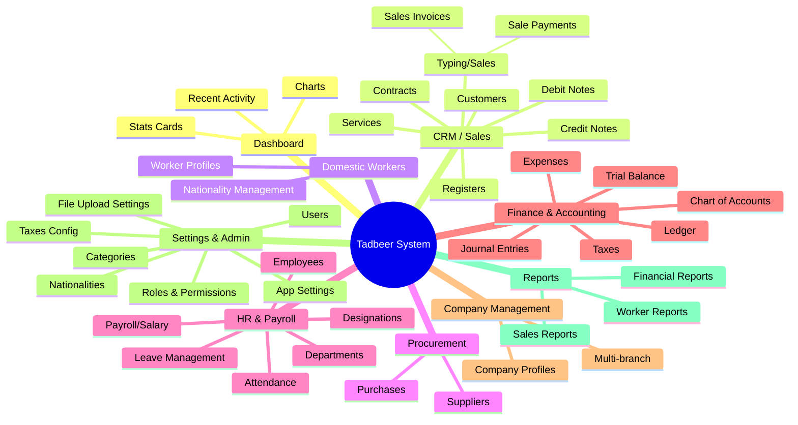
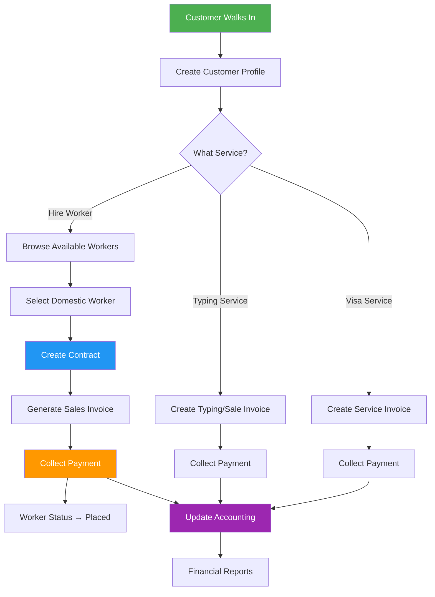
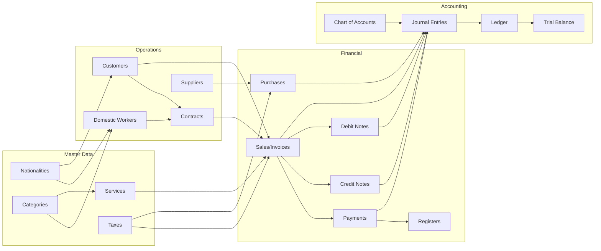
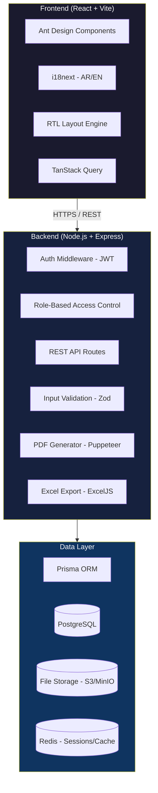
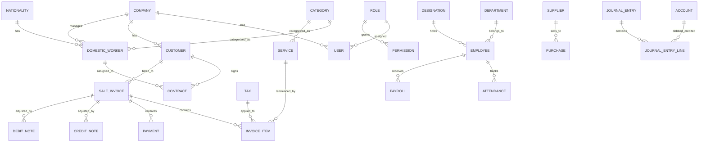

# 🏢 Tadbeer System — Complete Deep Analysis & Clone Scope

> **Application:** Tadbeer Management System  
> **Domain:** `tadbeer.tawjeeh.top`  
> **Industry:** UAE Domestic Worker Recruitment / Tadbeer Center Operations  
> **Analysis Date:** July 1, 2026  

---

## Table of Contents

1. [System Overview & Business Context](#1-system-overview--business-context)
2. [Complete Module Map](#2-complete-module-map)
3. [Detailed Module Analysis — Forms, Tables, Fields](#3-detailed-module-analysis)
4. [User Roles & Permissions](#4-user-roles--permissions)
5. [Workflow & Data Flow](#5-workflow--data-flow)
6. [Dashboard Analysis](#6-dashboard-analysis)
7. [Reports & Exports](#7-reports--exports)
8. [Language & Localization](#8-language--localization)
9. [Total Screens Estimate](#9-total-screens-estimate)
10. [Technology Recommendation & Architecture](#10-technology-recommendation--architecture)
11. [Project Scope & Effort Estimation](#11-project-scope--effort-estimation)
12. [Risk Assessment](#12-risk-assessment)

---

## 1. System Overview & Business Context

### What is Tadbeer?

**Tadbeer** is the UAE government-regulated system for managing **domestic worker recruitment centers**. These centers handle the full lifecycle of hiring and managing domestic workers (housemaids, nannies, drivers, cooks, etc.) for households in the UAE.

### What Does This Application Do?

This is a **full-stack ERP/business management system** purpose-built for a Tadbeer center. It handles:

| Business Function | What It Manages |
|---|---|
| **Customer Management** | UAE households/families who hire domestic workers |
| **Domestic Worker Management** | Worker profiles, nationalities, skills, status tracking |
| **Contracts** | Legal contracts between customers and workers |
| **Sales/Typing** | Service invoicing — "typing" refers to document typing/processing services common in UAE business centers |
| **Payments** | Payment collection and tracking |
| **Purchases & Suppliers** | Procurement from recruitment agencies / suppliers |
| **HR & Payroll** | Internal staff management, attendance, payroll |
| **Accounting/Finance** | Full double-entry accounting — chart of accounts, journals, ledger |
| **Company Management** | Multi-company / branch support |
| **Reporting** | Business analytics and compliance reports |

### Key Business Insight

> [!IMPORTANT]
> This is NOT a simple CRUD app. It's a **domain-specific ERP** with accounting, payroll, contract management, and compliance workflows. The "Tadbeer" branding and integration with "Tawjeeh" (UAE workforce guidance platform) implies it may also need to handle **government compliance reporting** and potentially **API integrations** with UAE government systems (MOHRE, ICP, etc.).

---

## 2. Complete Module Map

Based on route analysis and exploration, here is the full module tree:



### Module Breakdown Table

| # | Module | Route Pattern | Sub-Modules | Purpose |
|---|--------|--------------|-------------|---------|
| 1 | **Dashboard** | `/account/dashboard` | — | KPIs, charts, quick stats |
| 2 | **Services** | `/account/service` | List, Add/Edit | Define services offered (visa processing, contract typing, etc.) |
| 3 | **Customers** | `/account/customer` | List, Add/Edit, View | Manage customer (employer) profiles |
| 4 | **Company** | `/account/company` | List, Add/Edit | Company/branch profiles |
| 5 | **Typing/Sales** | `/account/sale` | List, Add/Edit, Invoice | Sales invoices for typing and other services |
| 6 | **Sale Payments** | `/account/sale-payments` | List | Payment records against sales/invoices |
| 7 | **Registers** | `/account/register` | List | Cash/payment registers |
| 8 | **Contracts** | `/account/contract` | List, Add/Edit, View | Worker-customer contracts |
| 9 | **Credit Notes** | `/account/credits` | List, Add/Edit | Refunds/credits to customers |
| 10 | **Debit Notes** | `/account/debits` | List, Add/Edit | Additional charges to customers |
| 11 | **Suppliers** | `/account/supplier` | List, Add/Edit | Recruitment agencies, vendors |
| 12 | **Purchases** | `/account/purchase` | List, Add/Edit | Purchase invoices from suppliers |
| 13 | **Domestic Workers** | `/account/domestic-worker` | List, Add/Edit, View | Worker profiles, documents, status |
| 14 | **Employees** | `/account/employee` (inferred) | List, Add/Edit | Internal staff records |
| 15 | **Departments** | `/account/departments` | List, Add/Edit | Organizational departments |
| 16 | **Designations** | `/account/designations` | List, Add/Edit | Job titles/designations |
| 17 | **Attendance** | `/account/attendance` (inferred) | List | Staff time tracking |
| 18 | **Payroll** | `/account/payroll` (inferred) | List, Generate | Salary calculation & disbursement |
| 19 | **Expenses** | `/account/expense` (inferred) | List, Add/Edit | Business expense tracking |
| 20 | **Chart of Accounts** | `/account/chart-of-accounts` (inferred) | Tree/List | Account classification |
| 21 | **Journal Entries** | `/account/journal` (inferred) | List, Add/Edit | Manual accounting entries |
| 22 | **Ledger** | `/account/ledger` (inferred) | Report | Account-wise transaction history |
| 23 | **Trial Balance** | `/account/trial-balance` (inferred) | Report | Period-end balancing report |
| 24 | **Taxes** | `/account/taxes` | List, Add/Edit | VAT configuration (5% UAE VAT) |
| 25 | **Nationalities** | `/account/nationalities` | List, Add/Edit | Worker nationality master data |
| 26 | **Categories** | `/account/categories` | List, Add/Edit | Service/worker categories |
| 27 | **Users** | `/account/users` | List, Add/Edit | System user management |
| 28 | **Roles** | `/account/roles` | List, Add/Edit | Role-based access control |
| 29 | **App Settings** | `/account/settings/app-settings` | Tabs (General, File Upload, etc.) | System configuration |
| 30 | **Reports** | `/account/reports` (inferred) | Multiple report types | Business intelligence |

---

## 3. Detailed Module Analysis

### 3.1 Services Module

**Purpose:** Define the services the Tadbeer center offers (e.g., visa processing, contract writing, medical typing, etc.)

**Expected Table Columns:**
| Column | Description |
|--------|-------------|
| ID / # | Auto-increment |
| Service Name (EN) | English name |
| Service Name (AR) | Arabic name |
| Category | Service category |
| Price | Service fee |
| Tax | Tax applicability |
| Status | Active/Inactive |
| Actions | Edit, Delete |

**Expected Form Fields:**
| Field | Type | Required | Notes |
|-------|------|----------|-------|
| Service Name (EN) | Text | ✅ | English service name |
| Service Name (AR) | Text | ❌ | Arabic service name |
| Category | Dropdown | ✅ | Links to categories module |
| Price | Number/Decimal | ✅ | Service fee amount |
| Tax | Dropdown | ❌ | Select applicable tax |
| Description | Textarea | ❌ | Service description |
| Status | Toggle/Dropdown | ✅ | Active/Inactive |

---

### 3.2 Customers Module

**Purpose:** Manage employer/household profiles — the people hiring domestic workers.

**Expected Table Columns:**
| Column | Description |
|--------|-------------|
| Customer ID | Auto/system generated |
| Name | Full name |
| Phone | Contact number |
| Email | Email address |
| Emirates ID | UAE national ID |
| Nationality | Customer nationality |
| Address | Location |
| Total Invoices | Count |
| Balance | Outstanding balance |
| Status | Active/Inactive |
| Actions | View, Edit, Delete |

**Expected Form Fields:**
| Field | Type | Required | Notes |
|-------|------|----------|-------|
| First Name | Text | ✅ | |
| Last Name | Text | ✅ | |
| Email | Email | ❌ | |
| Phone | Phone/Text | ✅ | UAE format |
| Emirates ID | Text | ✅ | 15-digit UAE ID |
| Nationality | Dropdown | ✅ | From nationalities master |
| Company | Dropdown | ❌ | Associated company |
| Address | Textarea | ❌ | |
| City | Text/Dropdown | ❌ | |
| Emirate | Dropdown | ❌ | Abu Dhabi, Dubai, Sharjah, etc. |
| Notes | Textarea | ❌ | |
| Profile Photo | File Upload | ❌ | |
| ID Document | File Upload | ❌ | Emirates ID scan |

---

### 3.3 Domestic Workers Module

**Purpose:** The core module — manages domestic worker profiles, documents, availability, and placement status.

> [!IMPORTANT]
> This is the most complex module in the system. A domestic worker record likely contains 30+ fields covering personal information, passport details, visa status, skills, medical records, and placement history.

**Expected Table Columns:**
| Column | Description |
|--------|-------------|
| Worker ID | System generated |
| Photo | Profile thumbnail |
| Full Name | Worker name |
| Nationality | Country of origin |
| Passport No. | Travel document |
| Visa Status | Valid/Expired/Processing |
| Category | Housemaid/Nanny/Driver/Cook etc. |
| Status | Available/Placed/On Leave/Terminated |
| Assigned Customer | Current employer |
| Contract Dates | Start/End |
| Actions | View, Edit, Delete |

**Expected Form Fields (Comprehensive):**

**Personal Information Section:**
| Field | Type | Required | Notes |
|-------|------|----------|-------|
| First Name (EN) | Text | ✅ | |
| Last Name (EN) | Text | ✅ | |
| Full Name (AR) | Text | ❌ | Arabic name |
| Date of Birth | Date Picker | ✅ | |
| Gender | Dropdown | ✅ | Male/Female |
| Nationality | Dropdown | ✅ | From nationalities master |
| Religion | Dropdown | ❌ | |
| Marital Status | Dropdown | ❌ | Single/Married/Divorced/Widowed |
| Education Level | Dropdown | ❌ | |
| Languages Spoken | Multi-select | ❌ | Arabic, English, Hindi, Filipino, etc. |
| Photo | File Upload | ❌ | Profile photo |

**Passport & Visa Section:**
| Field | Type | Required | Notes |
|-------|------|----------|-------|
| Passport Number | Text | ✅ | |
| Passport Issue Date | Date | ✅ | |
| Passport Expiry Date | Date | ✅ | |
| Passport Issue Country | Dropdown | ❌ | |
| Visa Number | Text | ❌ | |
| Visa Type | Dropdown | ❌ | |
| Visa Issue Date | Date | ❌ | |
| Visa Expiry Date | Date | ❌ | |
| Visa Status | Dropdown | ✅ | Valid/Expired/Processing/Cancelled |
| Unified Number | Text | ❌ | UAE immigration number |
| UID Number | Text | ❌ | |

**Work & Skills Section:**
| Field | Type | Required | Notes |
|-------|------|----------|-------|
| Worker Category | Dropdown | ✅ | Housemaid/Nanny/Driver/Cook/Guard |
| Skills | Multi-select/Checkboxes | ❌ | Cooking, cleaning, childcare, etc. |
| Experience (Years) | Number | ❌ | |
| Previous Countries | Text/Multi-select | ❌ | |
| Salary Expectation | Number | ❌ | Monthly in AED |
| Availability Date | Date | ❌ | |

**Medical Section:**
| Field | Type | Required | Notes |
|-------|------|----------|-------|
| Medical Status | Dropdown | ❌ | Fit/Unfit/Pending |
| Medical Report Date | Date | ❌ | |
| Medical Report | File Upload | ❌ | |

**Document Uploads:**
| Field | Type | Required | Notes |
|-------|------|----------|-------|
| Passport Copy | File Upload | ❌ | |
| Visa Copy | File Upload | ❌ | |
| Emirates ID Copy | File Upload | ❌ | |
| Medical Report | File Upload | ❌ | |
| Contract Copy | File Upload | ❌ | |
| Other Documents | File Upload (Multiple) | ❌ | |

**Status & Assignment:**
| Field | Type | Required | Notes |
|-------|------|----------|-------|
| Status | Dropdown | ✅ | Available/Placed/On Leave/Terminated/Absconding |
| Current Customer | Dropdown | ❌ | Links to customers module |
| Supplier/Agency | Dropdown | ❌ | Links to suppliers module |
| Notes | Textarea | ❌ | |

---

### 3.4 Contracts Module

**Purpose:** Legal agreements between customers (employers) and domestic workers. This is a legally required document in the UAE.

**Expected Table Columns:**
| Column | Description |
|--------|-------------|
| Contract # | Auto-generated |
| Customer Name | Employer |
| Worker Name | Domestic worker |
| Contract Type | New/Renewal/Temporary |
| Start Date | Contract start |
| End Date | Contract end |
| Amount | Contract value |
| Status | Active/Expired/Terminated/Draft |
| Actions | View, Edit, Print, Delete |

**Expected Form Fields:**
| Field | Type | Required | Notes |
|-------|------|----------|-------|
| Customer | Dropdown/Search | ✅ | Select from customers |
| Domestic Worker | Dropdown/Search | ✅ | Select from workers |
| Contract Type | Dropdown | ✅ | New/Renewal/Temporary/Transfer |
| Start Date | Date Picker | ✅ | |
| End Date | Date Picker | ✅ | |
| Contract Duration | Auto-calculated | — | Calculated from dates |
| Monthly Salary | Number | ✅ | Worker salary in AED |
| Contract Amount | Number | ✅ | Total contract value |
| Payment Terms | Dropdown | ❌ | |
| Terms & Conditions | Rich Text/Textarea | ❌ | |
| Contract Document | File Upload | ❌ | |
| Status | Dropdown | ✅ | Draft/Active/Expired/Terminated |
| Notes | Textarea | ❌ | |

---

### 3.5 Sales / Typing Module

**Purpose:** Generate invoices for services rendered — document typing, visa processing, contract preparation, etc.

**Expected Table Columns:**
| Column | Description |
|--------|-------------|
| Invoice # | Auto-generated |
| Date | Invoice date |
| Customer | Customer name |
| Services | Service items |
| Subtotal | Before tax |
| Tax (VAT) | 5% UAE VAT |
| Total | Grand total |
| Paid | Amount received |
| Balance | Outstanding |
| Status | Draft/Sent/Paid/Partial/Overdue |
| Actions | View, Edit, Print, Pay, Delete |

**Expected Form Fields:**
| Field | Type | Required | Notes |
|-------|------|----------|-------|
| Customer | Dropdown/Search | ✅ | Auto-populate from customers |
| Invoice Date | Date Picker | ✅ | Default: today |
| Due Date | Date Picker | ❌ | |
| Reference | Text | ❌ | External reference |
| **Line Items (Repeater):** | | | |
| → Service | Dropdown | ✅ | From services master |
| → Description | Text | ❌ | |
| → Quantity | Number | ✅ | Default: 1 |
| → Unit Price | Number | ✅ | Auto from service |
| → Tax | Dropdown | ❌ | VAT selection |
| → Line Total | Auto-calculated | — | Qty × Price |
| Subtotal | Auto-calculated | — | |
| Tax Amount | Auto-calculated | — | |
| Discount | Number | ❌ | |
| Grand Total | Auto-calculated | — | |
| Notes | Textarea | ❌ | |
| Attached Files | File Upload | ❌ | |

---

### 3.6 Payments Module

**Purpose:** Record payments received against sales invoices.

**Expected Table Columns:**
| Column | Description |
|--------|-------------|
| Payment # | Auto-generated |
| Date | Payment date |
| Customer | Payer |
| Invoice # | Related invoice |
| Amount | Payment amount |
| Method | Cash/Card/Bank/Cheque |
| Reference | Transaction ref |
| Status | Completed/Pending/Cancelled |

**Expected Form Fields:**
| Field | Type | Required | Notes |
|-------|------|----------|-------|
| Customer | Dropdown | ✅ | |
| Invoice | Dropdown | ✅ | Filtered by customer |
| Payment Date | Date | ✅ | |
| Amount | Number | ✅ | |
| Payment Method | Dropdown | ✅ | Cash/Card/Bank Transfer/Cheque |
| Reference # | Text | ❌ | |
| Notes | Textarea | ❌ | |
| Receipt Upload | File Upload | ❌ | |

---

### 3.7 Credit Notes & Debit Notes

**Credit Notes:** Refunds or credits issued to customers  
**Debit Notes:** Additional charges billed to customers

Both follow a similar structure to sales invoices but with opposite financial direction.

**Expected Fields (similar to Sales with modifications):**
| Field | Type | Required |
|-------|------|----------|
| Customer | Dropdown | ✅ |
| Related Invoice | Dropdown | ❌ |
| Date | Date | ✅ |
| Line Items | Repeater | ✅ |
| Reason | Textarea | ✅ |
| Total Amount | Auto-calculated | — |

---

### 3.8 Suppliers & Purchases Module

**Purpose:** Manage recruitment agencies and vendors; track purchase invoices.

**Supplier Form Fields:**
| Field | Type | Required |
|-------|------|----------|
| Company Name | Text | ✅ |
| Contact Person | Text | ❌ |
| Email | Email | ❌ |
| Phone | Phone | ✅ |
| Address | Textarea | ❌ |
| Tax Registration # | Text | ❌ |
| Country | Dropdown | ❌ |
| Notes | Textarea | ❌ |

**Purchase Invoice** mirrors the Sales invoice structure but is expense-side.

---

### 3.9 HR Module (Employees, Departments, Designations, Attendance)

**Employee Form Fields:**
| Field | Type | Required |
|-------|------|----------|
| Employee ID | Text/Auto | ✅ |
| First Name | Text | ✅ |
| Last Name | Text | ✅ |
| Email | Email | ✅ |
| Phone | Phone | ✅ |
| Department | Dropdown | ✅ |
| Designation | Dropdown | ✅ |
| Date of Joining | Date | ✅ |
| Salary | Number | ✅ |
| Emirates ID | Text | ❌ |
| Visa Status | Dropdown | ❌ |
| Bank Account | Text | ❌ |
| Emergency Contact | Text | ❌ |
| Photo | File Upload | ❌ |
| Documents | File Upload (Multiple) | ❌ |
| Status | Dropdown | ✅ |

**Attendance:** Daily check-in/check-out tracking  
**Departments:** Simple name-based master table  
**Designations:** Simple name-based master table  

---

### 3.10 Finance & Accounting Module

**Chart of Accounts:**
- Tree structure of account categories
- Types: Assets, Liabilities, Equity, Revenue, Expenses
- Account Code, Name, Type, Parent Account, Balance

**Journal Entries:**
- Date, Reference, Description
- Debit/Credit line items with account selection
- Double-entry validation (debits = credits)

**Ledger:** Account-wise transaction history with running balance  
**Trial Balance:** Period-end report showing all account balances  
**Expenses:** Business expense tracking with categories

---

### 3.11 Settings & Administration

**App Settings** (confirmed tabs from current browser state):
- General Settings (company info, logo, currency, timezone)
- File Upload Settings (allowed types, max size)
- Invoice Settings (numbering format, terms)
- Tax Settings (VAT configuration)
- Email/Notification Settings
- Backup Settings

**Users:** User account management with role assignment  
**Roles:** Granular permission matrix  
**Master Data:** Nationalities, Categories, Taxes  

---

## 4. User Roles & Permissions

### Expected Role Structure

Based on the dedicated Roles module (`/account/roles`), this system uses **Role-Based Access Control (RBAC)**.

| Role | Description | Access Level |
|------|-------------|--------------|
| **Super Admin** | Full system access, all modules | Full CRUD + Settings |
| **Admin** | Business operations management | Full CRUD, limited Settings |
| **Accountant** | Financial operations only | Finance, Payments, Reports |
| **Sales/Receptionist** | Customer-facing operations | Customers, Sales, Contracts, Payments |
| **HR Manager** | Staff management | Employees, Attendance, Payroll |
| **Data Entry / Typist** | Document processing | Sales/Typing, limited customer view |
| **Viewer / Auditor** | Read-only access | View all, edit nothing |

### Permission Granularity

Each role likely has a **permission matrix** covering:

```
For EACH module:
  ☐ View / List
  ☐ Create / Add
  ☐ Edit / Update
  ☐ Delete
  ☐ Export
  ☐ Print
```

> [!NOTE]
> The Roles page (`/account/roles`) almost certainly shows a **checkbox matrix** where each role can be assigned granular permissions per module. This is a standard pattern in Laravel-based admin systems.

---

## 5. Workflow & Data Flow

### Core Business Workflow



### Data Flow Between Modules



### Key Business Rules

1. **Customer → Contract → Invoice → Payment** is the primary happy path
2. **Domestic Worker status** changes based on contract lifecycle (Available → Placed → Contract Ended → Available)
3. **Every financial transaction** (sale, payment, purchase, credit/debit note) should generate **journal entries** in the accounting module
4. **VAT (5%)** is applied to taxable services per UAE tax law
5. **Registers** track daily cash positions
6. **Credit/Debit Notes** adjust previously issued invoices

---

## 6. Dashboard Analysis

### Expected Dashboard Components

| Component | Type | Data Source |
|-----------|------|-------------|
| **Total Customers** | Stat Card | Customers count |
| **Total Workers** | Stat Card | Domestic workers count |
| **Available Workers** | Stat Card | Workers with status "Available" |
| **Active Contracts** | Stat Card | Contracts with status "Active" |
| **Total Revenue (Month)** | Stat Card | Sum of paid invoices |
| **Outstanding Balance** | Stat Card | Sum of unpaid invoice balances |
| **Revenue Chart** | Bar/Line Chart | Monthly revenue over time |
| **Sales by Service** | Pie/Donut Chart | Revenue breakdown by service type |
| **Workers by Nationality** | Pie Chart | Worker distribution |
| **Workers by Category** | Bar Chart | Housemaid/Nanny/Driver etc. |
| **Recent Invoices** | Table/List | Last 5-10 invoices |
| **Recent Payments** | Table/List | Last 5-10 payments |
| **Expiring Contracts** | Alert List | Contracts ending within 30 days |
| **Expiring Visas** | Alert List | Worker visas expiring soon |

---

## 7. Reports & Exports

### Expected Reports

| Report | Description | Filters |
|--------|-------------|---------|
| **Sales Report** | Revenue by period, customer, service | Date range, customer, service |
| **Payment Report** | Payment collection summary | Date range, method, status |
| **Outstanding Report** | Unpaid invoices aging | Customer, date range |
| **Customer Statement** | Per-customer transaction history | Customer, date range |
| **Worker Report** | Worker inventory and status | Nationality, category, status |
| **Contract Report** | Active/expired contracts | Status, date range |
| **Profit & Loss** | Income vs expenses | Date range |
| **Balance Sheet** | Assets, liabilities, equity | As of date |
| **Trial Balance** | Account balances verification | Date range |
| **VAT Report** | Tax collected and payable | Tax period |
| **Attendance Report** | Staff attendance summary | Employee, date range |
| **Payroll Report** | Salary disbursement details | Month, department |

### Export Formats Expected
- **PDF** — For printing and sharing
- **Excel (XLSX)** — For data manipulation
- **Print** — Direct browser print
- Some reports may support **CSV** export

---

## 8. Language & Localization

### Bilingual Support: Arabic + English

| Aspect | Implementation |
|--------|---------------|
| **UI Language** | English primary, Arabic RTL support |
| **Data Entry** | Bilingual fields (Name EN / Name AR) for key entities |
| **Documents/Invoices** | Generated in both Arabic and English |
| **RTL Layout** | Full right-to-left layout support for Arabic |
| **Number Format** | Western numerals (not Eastern Arabic) |
| **Currency** | AED (UAE Dirham) — symbol: د.إ |
| **Date Format** | DD/MM/YYYY (UAE standard) |
| **Calendar** | Gregorian (with possible Hijri date display) |

> [!WARNING]
> **Bilingual/RTL is a major engineering effort.** The clone must support:
> - Full RTL CSS mirroring
> - Language toggle in the UI
> - Bilingual data storage (parallel EN/AR fields)
> - PDF generation in both languages
> - Arabic font rendering (Google Fonts: Cairo, Tajawal, or IBM Plex Arabic)

---

## 9. Total Screens Estimate

| Module | Screens | Breakdown |
|--------|---------|-----------|
| **Auth** | 3 | Login, Forgot Password, Reset Password |
| **Dashboard** | 1 | Main dashboard |
| **Services** | 2 | List + Add/Edit Form |
| **Customers** | 3 | List + Add/Edit Form + View Detail |
| **Domestic Workers** | 3 | List + Add/Edit Form + View Detail |
| **Contracts** | 3 | List + Add/Edit Form + View/Print |
| **Sales/Typing** | 3 | List + Add/Edit Invoice + View/Print |
| **Payments** | 2 | List + Add/Record Payment |
| **Registers** | 1 | List/View |
| **Credit Notes** | 2 | List + Add/Edit |
| **Debit Notes** | 2 | List + Add/Edit |
| **Suppliers** | 2 | List + Add/Edit |
| **Purchases** | 3 | List + Add/Edit + View |
| **Employees** | 3 | List + Add/Edit + View |
| **Departments** | 1 | List (inline edit or modal) |
| **Designations** | 1 | List (inline edit or modal) |
| **Attendance** | 2 | List + Mark Attendance |
| **Leave Management** | 2 | List + Apply/Approve |
| **Payroll** | 2 | List + Generate/View Payslip |
| **Chart of Accounts** | 2 | Tree View + Add/Edit |
| **Journal Entries** | 2 | List + Add/Edit |
| **Ledger** | 1 | Report View |
| **Trial Balance** | 1 | Report View |
| **Expenses** | 2 | List + Add/Edit |
| **Reports** | 6 | Various report pages |
| **Users** | 2 | List + Add/Edit |
| **Roles** | 2 | List + Permission Matrix |
| **Settings** | 4 | Multiple settings tabs |
| **Nationalities** | 1 | List (inline/modal) |
| **Categories** | 1 | List (inline/modal) |
| **Taxes** | 1 | List (inline/modal) |
| **Company** | 2 | List + Add/Edit |
| **Profile** | 1 | User profile page |
| **Notifications** | 1 | Notification center |
| **Error Pages** | 2 | 404, 500 |
| | | |
| **TOTAL** | **~70-75 unique screens** | |

---

## 10. Technology Recommendation & Architecture

### Why Not Just Node.js + PostgreSQL + React?

The user's initial suggestion (Node.js + PostgreSQL + React) is solid, but let me discuss **trade-offs** and **best-fit** options.

### Option A: Node.js + PostgreSQL + React ✅ (Recommended)

| Layer | Technology | Justification |
|-------|-----------|---------------|
| **Backend** | **Node.js (Express or Fastify)** | Fast, async, huge ecosystem. Best for API-driven apps. |
| **Database** | **PostgreSQL** | Best open-source RDBMS. Excellent for financial data, ACID compliance, JSON support. |
| **ORM** | **Prisma** or **TypeORM** | Type-safe database queries, migration management |
| **Frontend** | **React (Next.js or Vite)** | Component-based, massive ecosystem, great for complex UIs |
| **UI Framework** | **Ant Design** or **Shadcn/ui** | Enterprise-grade components (tables, forms, date pickers, RTL support) |
| **State Management** | **TanStack Query + Zustand** | Server state caching + lightweight client state |
| **Auth** | **JWT + Refresh Tokens** or **Passport.js** | Session management with role-based access |
| **PDF Generation** | **Puppeteer** or **jsPDF** | Invoice and report printing |
| **File Storage** | **S3-compatible** (AWS S3, MinIO, etc.) | Document uploads |
| **Language/i18n** | **i18next** | Industry standard for React internationalization |
| **RTL Support** | **Ant Design RTL** or **Tailwind RTL plugin** | Critical for Arabic support |

> [!TIP]
> **Why this stack wins:** Node.js + PostgreSQL + React gives you the best hiring pool, fastest development velocity, and the widest ecosystem of ready-made libraries for everything this system needs (PDF, Excel, charts, forms, RTL).

### Option B: Laravel + Vue.js (The "Original" Stack)

The original Tadbeer system is very likely built with **Laravel (PHP) + Vue.js or Blade templates** — this is by far the most common stack for this type of application in the UAE market.

| Aspect | Laravel Stack | Node.js Stack |
|--------|--------------|---------------|
| Development Speed | ⚡ Faster (batteries included) | 🔧 More assembly required |
| Community (UAE market) | ⭐⭐⭐⭐⭐ | ⭐⭐⭐ |
| Performance | Good | Better (async I/O) |
| Scalability | Good | Better |
| Real-time Features | Needs workarounds | Native (WebSockets) |
| Available Developers | Very common in UAE | Growing |
| Enterprise Features | Built-in (auth, queue, mail) | Need packages |

### Option C: Full TypeScript Monorepo (Advanced)

| Layer | Technology |
|-------|-----------|
| **Backend** | **NestJS** (TypeScript, structured, enterprise-grade) |
| **Database** | **PostgreSQL** with **Prisma** |
| **Frontend** | **Next.js 14+** (App Router, Server Components) |
| **Monorepo** | **Turborepo** or **Nx** |
| **Shared** | Shared TypeScript types between frontend and backend |

> This is the most maintainable long-term but has the steepest learning curve.

### 🏆 Final Recommendation

> [!IMPORTANT]
> **Go with Option A (Node.js + PostgreSQL + React)** — specifically:
> 
> - **Backend:** Express.js or Fastify with TypeScript
> - **Database:** PostgreSQL with Prisma ORM
> - **Frontend:** React with Vite + Ant Design (best RTL + enterprise component support)
> - **Auth:** JWT with role-based access control
> - **File handling:** Multer + S3-compatible storage
> - **PDF:** Puppeteer (server-side) for invoice/report generation
> - **i18n:** i18next with Arabic/English
> - **Charts:** Recharts or Chart.js

### Proposed Architecture



### Database Schema — High-Level ERD



---

## 11. Project Scope & Effort Estimation

### Phase Breakdown

| Phase | Duration | Description |
|-------|----------|-------------|
| **Phase 1: Foundation** | 3-4 weeks | Auth, Users, Roles, Settings, Company, Master Data (Nationalities, Categories, Taxes) |
| **Phase 2: Core Operations** | 4-5 weeks | Customers, Domestic Workers, Contracts, Services |
| **Phase 3: Financial** | 4-5 weeks | Sales/Invoicing, Payments, Purchases, Credit/Debit Notes, Registers |
| **Phase 4: Accounting** | 3-4 weeks | Chart of Accounts, Journal Entries, Ledger, Trial Balance |
| **Phase 5: HR & Payroll** | 3-4 weeks | Employees, Departments, Designations, Attendance, Payroll |
| **Phase 6: Dashboard & Reports** | 2-3 weeks | Dashboard widgets, All report views, Export functionality |
| **Phase 7: Localization & Polish** | 2-3 weeks | Full Arabic translation, RTL layout, PDF templates (AR/EN), Testing |
| **Phase 8: Testing & Deploy** | 2-3 weeks | End-to-end testing, Performance optimization, Deployment |

### Total Estimated Timeline

| Scenario | Duration | Team Size |
|----------|----------|-----------|
| **Solo Full-Stack Developer** | 6-8 months | 1 developer |
| **Small Team (Recommended)** | 3-4 months | 2 full-stack + 1 frontend |
| **Larger Team** | 2-3 months | 2 backend + 2 frontend + 1 QA |

### Effort in Person-Days

| Module | Backend (days) | Frontend (days) | Total |
|--------|---------------|-----------------|-------|
| Auth & RBAC | 8 | 5 | 13 |
| Users & Roles | 5 | 5 | 10 |
| Settings | 5 | 5 | 10 |
| Master Data (4 modules) | 6 | 6 | 12 |
| Customers | 5 | 6 | 11 |
| Domestic Workers | 8 | 10 | 18 |
| Contracts | 7 | 8 | 15 |
| Services | 3 | 3 | 6 |
| Sales/Invoicing | 10 | 12 | 22 |
| Payments | 5 | 5 | 10 |
| Registers | 3 | 3 | 6 |
| Credit/Debit Notes | 6 | 6 | 12 |
| Suppliers & Purchases | 8 | 8 | 16 |
| Employees | 5 | 6 | 11 |
| Departments & Designations | 3 | 3 | 6 |
| Attendance | 5 | 5 | 10 |
| Payroll | 8 | 8 | 16 |
| Chart of Accounts | 6 | 6 | 12 |
| Journal Entries | 8 | 8 | 16 |
| Ledger & Trial Balance | 6 | 5 | 11 |
| Expenses | 4 | 4 | 8 |
| Dashboard | 6 | 10 | 16 |
| Reports & Exports | 10 | 8 | 18 |
| Arabic/RTL/i18n | 5 | 12 | 17 |
| PDF Generation | 8 | 2 | 10 |
| File Upload System | 4 | 3 | 7 |
| Notifications | 4 | 4 | 8 |
| Testing & Bug Fixes | 15 | 15 | 30 |
| | | | |
| **TOTAL** | **~174 days** | **~185 days** | **~359 person-days** |

---

## 12. Risk Assessment

| Risk | Severity | Mitigation |
|------|----------|------------|
| **Accounting accuracy** | 🔴 High | Use established double-entry patterns; hire accountant for validation |
| **UAE compliance** | 🔴 High | Research MOHRE/Tadbeer regulations; may need government API integration |
| **RTL/Arabic bugs** | 🟡 Medium | Use Ant Design's built-in RTL; test with native Arabic speakers |
| **PDF generation quality** | 🟡 Medium | Invest time in Puppeteer templates; match original layout |
| **Data migration** | 🟡 Medium | Plan data export from existing system early |
| **Performance with large datasets** | 🟡 Medium | Implement pagination, indexing, query optimization from day 1 |
| **Scope creep** | 🟡 Medium | Strict phase adherence; prioritize core modules |
| **VAT calculation edge cases** | 🟡 Medium | Test extensively with real invoice scenarios |
| **Multi-company isolation** | 🟡 Medium | Implement company_id tenant isolation at database level |
| **File storage scaling** | 🟢 Low | Use S3-compatible storage from the start |

---

## Summary & Next Steps

> [!IMPORTANT]
> ### Key Takeaways
> 
> 1. **This is a ~70-75 screen ERP system** — not a simple app
> 2. **~30 database tables** will be needed minimum
> 3. **Bilingual Arabic/English with RTL** is a significant engineering effort
> 4. **Double-entry accounting** requires careful implementation
> 5. **Estimated effort: ~360 person-days** (3-4 months with a small team)
> 6. **Recommended stack: Node.js + PostgreSQL + React + Ant Design + Prisma**

### Recommended Next Steps

1. **✅ Finalize this analysis** — Review and approve this scope document
2. **📐 Design the database schema** — Create detailed Prisma schema with all relations
3. **🎨 Design the UI/UX** — Create wireframes or use the existing system as reference
4. **🔨 Start Phase 1** — Auth, Users, Roles, Settings foundation
5. **📋 Set up project structure** — Monorepo with shared types, API, and frontend

> When you're ready, say the word and I'll start building — module by module, starting with the database schema and project foundation.
